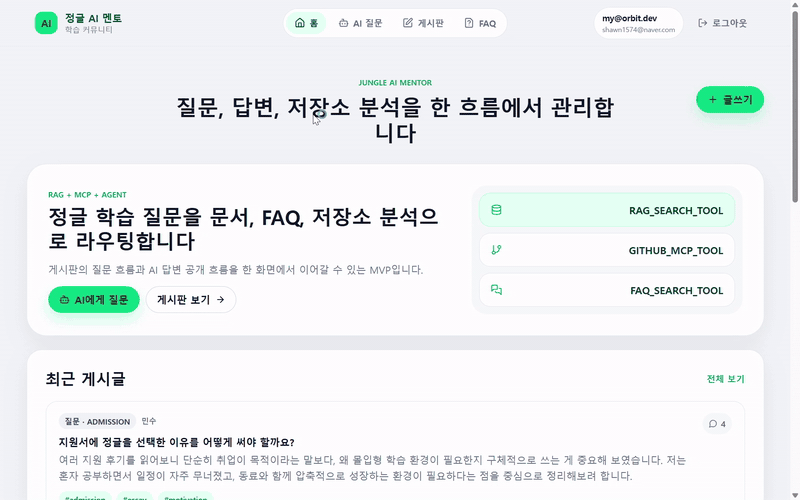
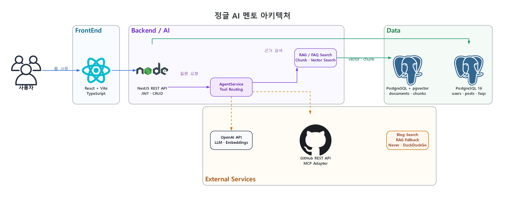

<p align="center">
  
</p>

# 정글 AI 멘토 게시판 MVP

React, NestJS, PostgreSQL, pgvector 기반의 AI 학습 커뮤니티 게시판 MVP입니다. 사용자는 회원가입/로그인 후 질문과 정보 공유 글을 작성하고, 댓글과 태그/검색/페이징으로 게시판을 사용할 수 있습니다. AI 기능은 RAG Q&A, GitHub 저장소 MCP 분석, Agent 기반 tool routing으로 구성했습니다.

## 주요 기능
- JWT 기반 회원가입, 로그인, 내 정보 조회
- 게시글 CRUD, 댓글 CRUD, 태그, 검색, 페이지네이션
- 질문 게시판과 정보공유 게시판 구분
- 관리자 문서 등록 후 chunking, embedding, pgvector 검색
- AI 질문 답변 저장과 공개 FAQ 발행
- FAQ 목록/상세, 키워드/카테고리 검색, 조회수 증가
- GitHub 저장소 분석 MCP adapter와 mock/fallback 모드
- AgentService 기반 질문 분류와 tool routing
- 크래프톤 정글 관련 블로그 사전 인덱싱, 본문 추출, RAG 저장
- 외부 API 연결 없이도 데모 가능한 mock LLM, mock embedding, mock MCP

## 아키텍처

<p align="center">
  
</p>

사용자 요청은 React 클라이언트에서 NestJS REST API로 전달됩니다. 일반 게시판 데이터는 PostgreSQL에 저장되고, AI 질문은 AgentService가 RAG 검색, OpenAI 답변 생성, GitHub 저장소 분석, 블로그 검색 도구로 분기합니다. 문서 chunk와 embedding은 pgvector를 통해 검색합니다.

다이어그램 원본은 [`docs/architecture.py`](docs/architecture.py)에서 확인할 수 있습니다.

## RAG 구조
1. `POST /api/admin/documents`로 문서를 등록합니다.
2. 백엔드가 문서를 chunk로 나누고 embedding을 생성합니다.
3. OpenAI Embeddings를 사용할 수 있으면 실제 embedding을 생성합니다.
4. 외부 API를 사용할 수 없으면 deterministic mock embedding을 사용합니다.
5. 검색 시 pgvector distance query를 먼저 시도하고, 실패하면 lexical fallback을 사용합니다.
6. `/api/ai/ask`는 AgentService를 거쳐 `RAG_SEARCH_TOOL`을 선택할 수 있습니다.

## MCP 구조
- API: `POST /api/mcp/github/analyze`
- Mock 모드는 외부 연결 없이 데모 분석을 반환합니다.
- GitHub API 모드는 README, 저장소 metadata, root files를 조회합니다.
- MCP stdio 모드는 인터페이스 준비 상태이며 현재 MVP에서는 mock fallback을 반환합니다.
- 외부 API 호출이 실패해도 전체 요청은 실패하지 않고 fallback 응답을 반환합니다.

## 블로그 사전 인덱싱 구조
질문할 때마다 블로그를 검색하면 느리고 embedding 비용이 중복으로 발생합니다. 그래서 기본 구조는 사전 인덱싱입니다.

```text
하루 1회 또는 수동 sync
→ 크래프톤 정글 관련 블로그 검색
→ 블로그 글 본문 추출
→ RagService.indexDocument()로 새 글만 embedding, 변경 글은 re-index, 동일 글은 skip
→ chunking, embedding, pgvector 저장

사용자 질문
→ 질문 embedding
→ pgvector 검색
→ 관련 chunk를 근거로 답변
```

수동 sync API:
```text
POST /api/admin/blogs/sync
```

질문 화면의 `크래프톤 정글 블로그 미리 인덱싱` 버튼도 같은 API를 호출합니다.

질문 화면의 `근거 부족 시 블로그 검색 보강` 옵션이 켜져 있으면, 저장된 pgvector 검색 결과가 없거나 너무 약할 때만 실시간 검색 fallback을 수행합니다.

블로그 검색은 DuckDuckGo HTML 검색을 기본 fallback으로 사용하며, Naver Blog Search API 연동과 자동 주기 sync도 지원합니다.

## Agent 구조
`/api/ai/ask` 요청은 반드시 `AgentService`를 거칩니다.

라우트:
- `JUNGLE_KNOWLEDGE`: 정글/학습/입학/상담 질문, `RAG_SEARCH_TOOL`
- `FAQ_SEARCH`: FAQ 관련 질문, `FAQ_SEARCH_TOOL`
- `GITHUB_REPO`: repository URL 또는 GitHub 질문, `GITHUB_MCP_TOOL`
- `GENERAL`: 일반 질문, `GENERAL_LLM_TOOL`

응답에는 `agentRoute`, `usedTools`, `agentState`, `references`가 포함됩니다.

## 실행 방법
Windows PowerShell에서 `npm.ps1` 실행 정책에 막히는 경우 `npm.cmd`를 사용합니다.

```powershell
Copy-Item .env.example backend\.env
docker compose up -d
npm.cmd --prefix backend install
npm.cmd --prefix frontend install
npm.cmd --prefix backend run start:dev
npm.cmd --prefix frontend run dev
```

접속:
- Frontend: `http://localhost:5173`
- Backend health: `http://localhost:3000/api/health`
