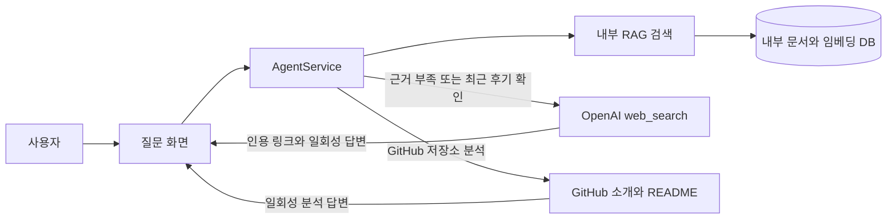

<p align="center">
  
</p>

# 정글 AI 멘토 게시판 MVP

React, NestJS, PostgreSQL, pgvector 기반의 AI 학습 커뮤니티 게시판 MVP입니다. 사용자는 회원가입/로그인 후 질문과 정보 공유 글을 작성하고, 댓글과 태그/검색/페이징으로 게시판을 사용할 수 있습니다. AI 기능은 RAG Q&A, GitHub 저장소 MCP 분석, Agent 기반 tool routing으로 구성했습니다.

## 주요 기능
- JWT 기반 회원가입, 로그인, 내 정보 조회
- 게시글 CRUD, 댓글 CRUD, 태그, 검색, 페이지네이션
- 질문 게시판과 정보공유 게시판 구분
- 관리자 문서 등록 후 chunking, embedding, pgvector 검색
- 내부 자료를 이용한 AI 질문 답변 저장과 공개 FAQ 발행
- FAQ 목록/상세, 키워드/카테고리 검색, 조회수 증가
- GitHub 저장소 소개·README 분석 adapter와 mock/fallback 모드
- AgentService 기반 질문 분류와 tool routing
- 질문 성격에 맞춘 일회성 웹 검색과 인용 링크 표시
- 외부 API 연결 없이도 데모 가능한 mock LLM, mock embedding, mock MCP

## 아키텍처



사용자 요청은 React 클라이언트에서 NestJS REST API로 전달됩니다. 일반 게시판 데이터는 PostgreSQL에 저장되고, AI 질문은 AgentService가 RAG 검색, OpenAI 답변 생성, GitHub 저장소 분석, 블로그 웹 검색 도구로 분기합니다. 등록된 내부 문서의 chunk와 embedding은 pgvector를 통해 검색합니다.


## RAG 구조
1. `POST /api/admin/documents`로 문서를 등록합니다.
2. 백엔드가 문서를 chunk로 나누고 embedding을 생성합니다.
3. OpenAI Embeddings를 사용할 수 있으면 실제 embedding을 생성합니다.
4. `RAG_EMBEDDING_MODE=mock`을 demo/local에서 명시적으로 설정한 경우에만 deterministic mock embedding을 사용합니다. production에서는 실제 임베딩 실패를 mock으로 바꾸지 않습니다.
5. Markdown 구조를 보존하며 실제 토큰 수로 chunk를 나누고, 색인 버전과 출처를 저장합니다.
6. 검색 시 pgvector와 PostgreSQL 전문 검색 후보를 결합합니다. 검색 장애 상태에서는 신뢰할 수 있는 RAG 답변을 생성하지 않습니다.
7. `/api/ai/ask`는 AgentService를 거쳐 `RAG_SEARCH_TOOL`을 선택할 수 있습니다.

실제 임베딩 환경에서는 검색 후보와 질문을 모델로 비교해 근거 충분성을 확인합니다. API 키가 없는 명시적 로컬 mock 데모에서는 후보 기반 mock 답변만 표시하며 품질 판정 결과로 사용하지 않습니다.

## MCP 구조
- API: `POST /api/mcp/github/analyze`
- Mock 모드는 외부 연결 없이 데모 분석을 반환합니다.
- GitHub API 모드는 저장소 이름·설명과 README를 조회합니다.
- MCP stdio 모드는 인터페이스 준비 상태이며 현재 MVP에서는 mock fallback을 반환합니다.
- 외부 API 호출이 실패해도 전체 요청은 실패하지 않고 fallback 응답을 반환합니다.

## 일회성 웹 검색
`GENERAL` 질문은 내부 게시글을 먼저 검색합니다. 최근 후기는 정상적인 내부 검색 후보가 나온 직후 웹 검색과 내부 근거 판정을 겹쳐 실행하고, 다른 질문은 내부 근거가 부족할 때 OpenAI Responses API의 `web_search`를 한 번 실행합니다. 내부 검색 장애나 활성 색인 없음은 외부 검색으로 감추지 않습니다.

```text
사용자 질문 → 내부 게시글 검색 → 질문의 대상·주제·시점에 대한 근거 판정
→ 일반 질문: 근거가 부족하면 질문에서 검색어를 만들어 웹 검색
→ 최근 후기: 내부 검색이 정상이면 웹 후기 검색과 근거 판정을 겹쳐 실행
→ 실제 인용된 출처가 있으면 답변과 링크를 화면에 표시
```

웹 검색은 요청당 20초 제한이며 자동 재시도하지 않습니다. 후기 질문에서는 인용된 블로그를 요구하고, 공식 일정·규정 질문에서는 공식 원문을 우선 찾도록 요청합니다. 해당 사이트가 실제 공식 사이트인지는 URL 인용만으로 확정할 수 없습니다. 채택할 인용 출처가 없거나 호출에 실패하면 근거 부족 안내를 표시합니다. 요청에는 `store: false`를 설정해 OpenAI API 응답의 사후 조회용 저장을 끕니다. 이 설정이 외부 서비스의 모든 보존 정책을 바꾸는 것은 아닙니다.

블로그 글·GitHub 자료의 본문과 임베딩은 DB에 저장하지 않습니다. 외부 자료를 사용한 답변도 질문 기록과 FAQ에 저장하지 않으며, 화면에 표시된 답변과 실제 인용 링크는 화면을 벗어나면 보존하지 않습니다. 이전에 수집된 `BLOG_SEARCH` 문서는 검색·재색인에서 제외합니다. 기존 DB 행의 삭제는 별도 대상 확인 후 결정합니다.

질문 응답의 `retrievalStatus`는 내부 검색 상태이고, `externalAugmentationStatus`는 외부 검색 미요청·검색했지만 인용할 블로그 없음·답변 근거로 사용·검색 실패를 구분합니다. 외부 검색 실패를 내부 검색 장애로 표시하지 않습니다.

## Agent 구조
`/api/ai/ask` 요청은 반드시 `AgentService`를 거칩니다.

라우트:
- `GENERAL`: 정글/학습/입학/상담과 다른 일반 질문 모두 내부 `RAG_SEARCH_TOOL`을 먼저 사용하고, 질문 성격에 따라 웹 검색을 보강
- `FAQ_SEARCH`: FAQ 관련 질문, `FAQ_SEARCH_TOOL`
- `GITHUB_REPO`: repository URL 또는 GitHub 질문, `GITHUB_MCP_TOOL`

이전 질문 기록의 `JUNGLE_KNOWLEDGE` 값은 보존합니다. 새 질문은 이 값을 사용하지 않습니다.

응답에는 `agentRoute`, `usedTools`, `agentState`, `references`가 포함됩니다.

정글 지식 답변의 `[1]` 같은 번호는 아래 참고 근거의 같은 번호와 연결됩니다. 근거에는 문서 제목·URL·chunk ID·섹션·원문 범위·색인 버전이 포함될 수 있습니다. 생성된 답변에 유효한 근거 번호가 하나도 없거나 존재하지 않는 번호가 있으면 답변 대신 재시도 안내를 표시합니다. 번호 검사는 출처 연결만 확인하며, 문장 내용의 사실 여부는 별도 평가가 필요합니다.

`/admin/*` API는 로그인과 운영자 이메일 허용 목록을 모두 검사합니다. 서버 환경 변수 `ADMIN_EMAIL_ALLOWLIST`에 운영자 계정 이메일을 쉼표로 구분해 설정합니다. 비어 있으면 모든 관리자 API 접근을 거부합니다. 이메일 목록은 응답이나 로그에 포함하지 않습니다.

운영자는 `RAG 운영` 화면에서 현재 프로세스의 검색·색인 지표와 재색인 대상을 조회할 수 있습니다. 상태 해석과 대응 절차는 [RAG 운영 점검 절차](docs/rag-operations-runbook.md)를 참고합니다.

## 실행 방법
Windows PowerShell에서 `npm.ps1` 실행 정책에 막히는 경우 `npm.cmd`를 사용합니다.

```powershell
Copy-Item .env.example backend\.env
docker compose up -d
npm.cmd --prefix backend install
npm.cmd --prefix frontend install
npm.cmd --prefix backend run start:dev
npm.cmd --prefix frontend run dev
```

접속:
- Frontend: `http://localhost:5173`
- Backend health: `http://localhost:3000/api/health`

관리자 허용 이메일은 공개 회원가입에서 차단합니다. 관리자 생성은 대화형 전용 명령으로 수행하며 기존 계정은 덮어쓰지 않습니다. [안전한 관리자 계정 생성 절차](docs/admin-account-provisioning.md)를 먼저 확인하세요.
